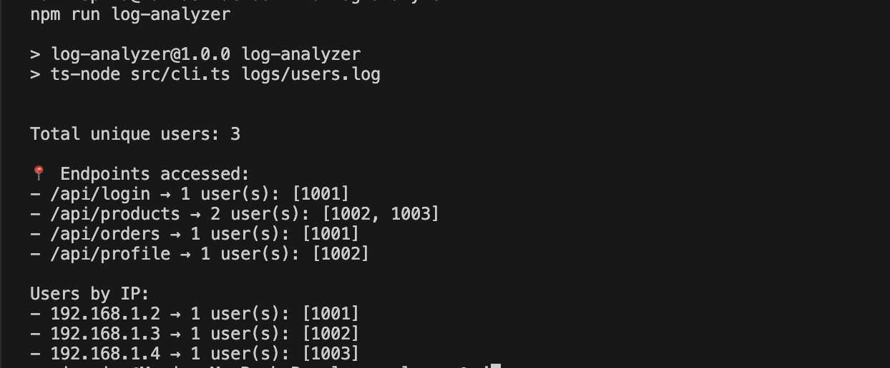

# Log Analyzer Middleware Library

## Overview

`log-analyzer` is a lightweight **Express middleware library** that helps you:

- Track **unique IP addresses** accessing your API endpoints,
- Assign each IP a **unique numeric ID** starting from 0,
- Log API requests with details including timestamp, IP, IP ID, user ID, HTTP method, and endpoint path,
- Produce logs in a standard format that can later be analyzed by a CLI tool or programmatically.



This middleware makes it easy to add user v& IP analytics without building custom logging from scratch.

-----------------

## How It Works

- When a request hits your Express server and passes through the `logAnalyzer` middleware:
  - The client’s IP is extracted.
  - If the IP is new, it is assigned a new unique numeric ID (`0`, `1`, `2`, ...).
  - Request metadata including timestamp, IP, IP ID, user ID (from request header), HTTP method, and endpoint are logged to a file (`logs/users.log` by default).
- The library maintains an **in-memory mapping** of IPs to their assigned IDs while the server is running.
- Logs can be later analyzed by your companion CLI tool or other analysis utilities.

------------------

## Installation

```bash
npm install log-analyzer
npm install express          # Peer dependency, if not already installed
npm install --save-dev @types/express
```

### Usage

1. Import and apply the middleware in your Express app or router:

```bash
import express from 'express';
import { logAnalyzer } from 'log-analyzer';

const app = express();

app.use(logAnalyzer);  // Logs all requests on every route

app.get('/api/products', (req, res) => {
  res.json({ message: 'Products list' });
});

app.listen(3000, () => {
  console.log('Server running on http://localhost:3000');
});
```

Or apply selectively on specific routes:

```bash
import express from 'express';
import { logAnalyzer } from 'log-analyzer';

const router = express.Router();

router.get('/events', logAnalyzer, (req, res) => {
  res.send('Events data');
});

app.use(router);
```

2. Add a user-id header in requests to track users. 
If user-id is missing, it defaults to "unknown" in logs.

The middleware looks for user-id in request headers:

```bash
GET /api/products HTTP/1.1
Host: example.com
user-id: 1001
```

3. Logs are saved at `logs/users.log`

Example log line:
`2025-07-06T12:00:00Z ip=192.168.1.2 ip_id=0 user_id=1001 GET /api/login`

4. Add `analyzer` into your scripts in the folder `package.json` to be able to run `npm run analyzer` and see the logs details.

```bash
"scripts": {
    "analyzer": "ts-node src/cli.ts logs/users.log",
  },
```

The output should be something like:

```bash
Total unique users: 3

📍 Endpoints accessed:
- /api/login → 1 user(s): [1001]
- /api/products → 2 user(s): [1002, 1003]
- /api/orders → 1 user(s): [1001]
- /api/profile → 1 user(s): [1002]

Users by IP:
- 192.168.1.2 → 1 user(s): [1001]
- 192.168.1.3 → 1 user(s): [1002]
- 192.168.1.4 → 1 user(s): [1003]
```